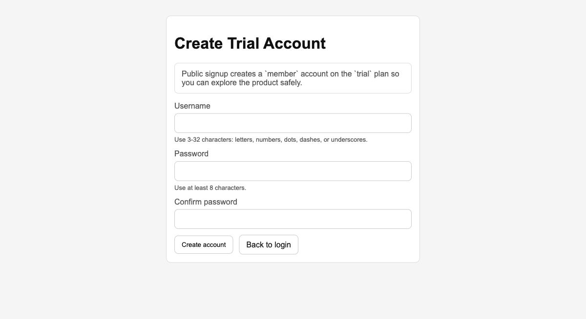
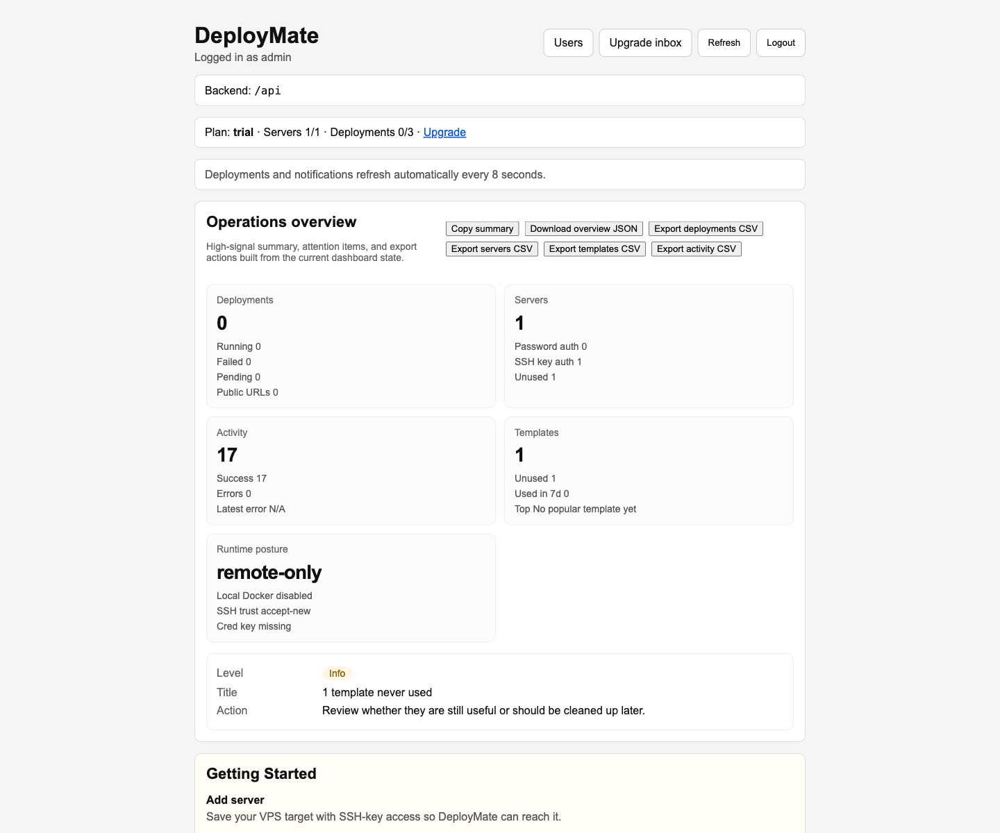
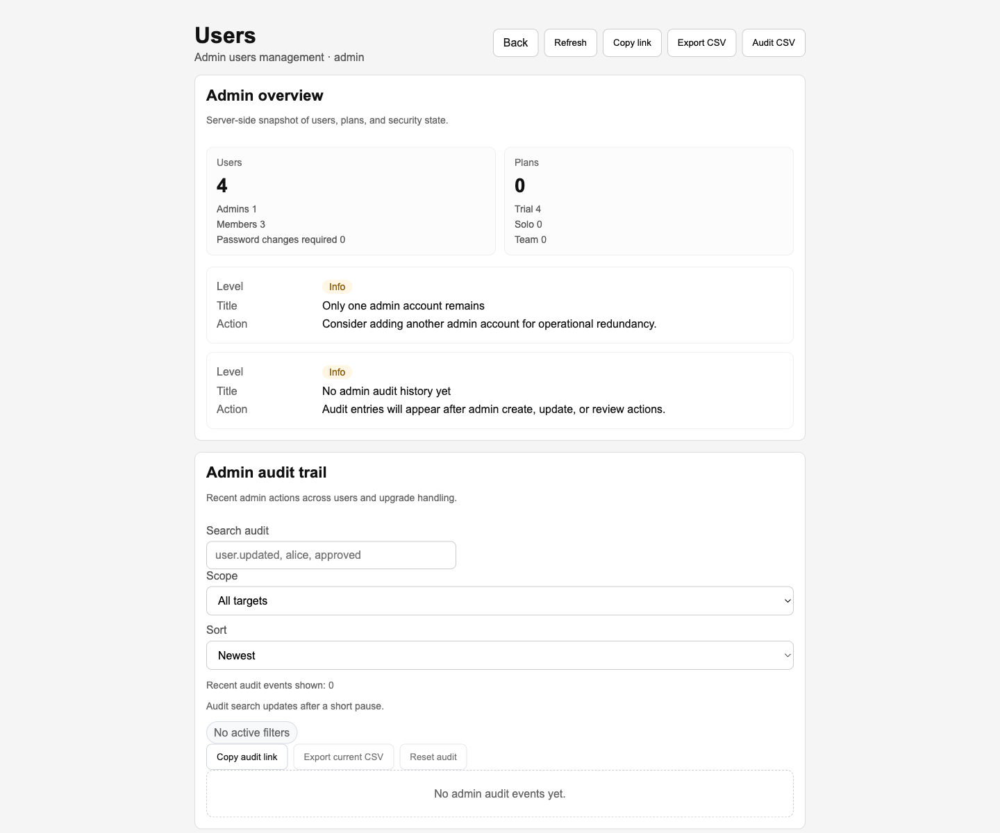
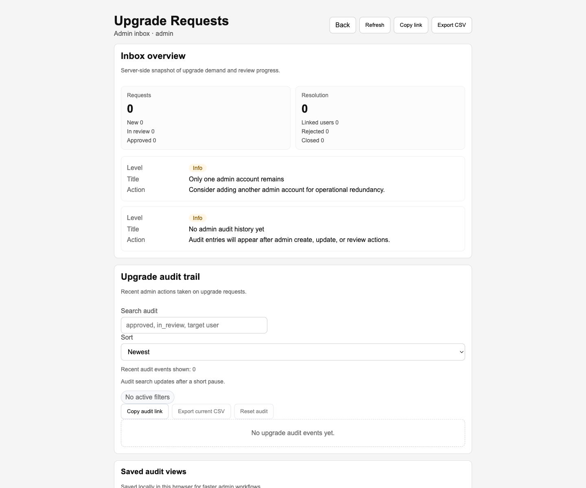

<p align="center">
  
</p>

<h1 align="center">DeployMate</h1>

<p align="center">
  Self-hosted Docker deployment control panel with admin tooling, operational visibility, backup dry-runs, and release safety checks.
</p>

<p align="center">
  <strong>Source-available:</strong> PolyForm Noncommercial 1.0.0
  <br />
  Commercial, internal business, client, SaaS, and resale use require a separate commercial license.
</p>

<p align="center">
  <a href="https://deploymatecloud.ru">Live App</a>
  ·
  <a href="https://deploymatecloud.ru/register">Create Trial Account</a>
  ·
  <a href="https://deploymatecloud.ru/login">Login</a>
</p>

DeployMate is a self-hosted deployment control panel for small teams that need a fast way to ship Docker containers, manage reusable templates, track operational state, and handle lightweight admin workflows from one UI.

It is built for pragmatic operator experience rather than platform complexity.

## License

This repository is source-available, not open source.

- public code license: [PolyForm Noncommercial 1.0.0](LICENSE)
- commercial/business use: not permitted under the public license
- for business, internal company, client, SaaS, or resale use: request a separate commercial license first

See [COMMERCIAL-LICENSE.md](COMMERCIAL-LICENSE.md) for the business-use policy and [NOTICE](NOTICE) for the short-form repository notice.

Commercial licensing entry points:

- public explanation: `https://deploymatecloud.ru/commercial-license`
- request flow: `https://deploymatecloud.ru/upgrade`
- owner contact: `mailto:alexgerlitz@users.noreply.github.com`
- expected first reply: usually within 2 business days
- production contact alias is configurable via `NEXT_PUBLIC_BUSINESS_CONTACT_EMAIL`

## Reviewer Package

If you are opening this repository as a hiring reviewer, these are the fastest entry points:

- live app: `https://deploymatecloud.ru`
- public signup: `https://deploymatecloud.ru/register`
- release notes: [docs/releases/v0.1.0.md](docs/releases/v0.1.0.md)
- roadmap: [ROADMAP.md](ROADMAP.md)
- architecture overview: [ARCHITECTURE.md](ARCHITECTURE.md)
- production/release discipline: [RUNBOOK.md](RUNBOOK.md), [SAFE-RELEASE.md](SAFE-RELEASE.md), [SECURITY.md](SECURITY.md)

What to evaluate quickly:

- product depth: deployments, templates, servers, admin users, upgrade requests, backup dry-run
- engineering maturity: scripted preflight, smoke coverage, remote release flow, production docs
- operational thinking: security posture, runtime capability boundaries, release safety checks

## Five-Minute Evaluation Path

If you want the shortest coherent pass through the project:

1. open the live app at `https://deploymatecloud.ru/login`
2. use demo access or create a trial account
3. inspect `/app` and one deployment detail page for the runtime story
4. inspect `/app/server-review` for the dedicated server workspace
5. inspect `/app/users` and `/app/upgrade-requests` for admin depth
6. return to [ARCHITECTURE.md](ARCHITECTURE.md), [RUNBOOK.md](RUNBOOK.md), and [ROADMAP.md](ROADMAP.md) for system and release framing

If you are evaluating whether this is more than a UI shell, the quickest evidence is:

- live demo surface
- release workflow and smoke discipline
- roadmap and documentation continuity from product to operations

## Product Preview

Public trial signup is enabled, and the deployed app already exposes the richer operator and admin surfaces:

### Trial onboarding



### Operator dashboard



### Admin workflows





## Try It Live

Public trial signup is enabled on the live instance:

- app: `https://deploymatecloud.ru`
- signup: `https://deploymatecloud.ru/register`
- login: `https://deploymatecloud.ru/login`

Reviewer path:

1. create a trial account
2. land in the app immediately after signup
3. open `/app/server-review` to inspect the dedicated server workspace
4. open `/app/users` and `/app/upgrade-requests` to inspect the richer admin surface
5. review saved views, bulk actions, audit trail, backup bundle, and restore dry-run tooling


Recommended reviewer order:

1. `/app` for the operator overview
2. `/deployments/[deploymentId]` for runtime state and observability
3. `/app/server-review` for live server create/edit/test/diagnostics/delete flow
4. `/app/users` for admin saved views, bulk actions, audit, and recovery tooling
5. `/app/upgrade-requests` for workflow depth, exports, and admin triage surface

## Why This Project Is Interesting

- one product surface covers deployments, servers, templates, activity, admin users, upgrade requests, backups, and restore dry-runs
- production release flow is already scripted with preflight and post-deploy smoke checks
- the admin surface has saved views, bulk actions, exports, audit history, and backup tooling
- production security posture was improved with a remote-only deployment profile and safer SSH defaults

## At A Glance

| Area | What is already implemented |
| --- | --- |
| Deployments | create, redeploy, inspect, delete, logs, health, activity |
| Servers | dedicated `/app/server-review` workspace with saved SSH targets, create/edit/test/diagnostics/delete, and suggested ports |
| Templates | reusable presets, usage tracking, preview, duplicate, filters |
| Admin users | filters, saved views, bulk actions, exports, audit trail |
| Upgrade inbox | filters, saved views, bulk actions, exports, audit trail |
| Recovery | backup bundle export and restore dry-run conflict analysis |
| Release safety | preflight, admin smoke, post-deploy smoke |

## Feature Highlights

### Web Terminal sidecar

- a separate operator-side `Web Terminal` exists for direct server work with Codex and tmux
- the reference location and maintenance rules live in [WEB-TERMINAL.md](/Users/alexgerlitz/deploymate/WEB-TERMINAL.md)
- the current public entry is `lab.deploymatecloud.ru`

### Deployment operations

- create, redeploy, inspect, and delete Docker deployments
- support reusable deployment templates with usage tracking and preview
- inspect logs, health, activity, and external port mappings
- target either local Docker or remote SSH hosts, with production capable of running in remote-only mode
- optional public signup for safe `trial` accounts

### Server management

- use the dedicated `/app/server-review` workspace as the main server surface
- register remote servers with SSH-key auth for new targets
- edit, test, diagnose, and delete saved targets from the same review flow
- fetch suggested free ports before runtime work

### Admin tooling

- manage users, roles, plans, and password-reset state
- process upgrade requests with filters, exports, bulk actions, and audit trail
- use saved views for both users and upgrade inbox workflows
- export admin data and operational snapshots as JSON or CSV

### Backup and recovery

- download a structured backup bundle
- run restore dry-run analysis without applying changes
- inspect conflicts before any future restore workflow

## Stack

- `FastAPI`
- `Next.js`
- `PostgreSQL`
- `Docker Compose`
- `Caddy`

## Architecture At A Glance

```text
Browser
  -> Next.js frontend
    -> FastAPI backend
      -> PostgreSQL
      -> Docker runtime or remote SSH targets
```

More detail: see [ARCHITECTURE.md](ARCHITECTURE.md).
Project focus rules: see [PROJECT-RULES.md](PROJECT-RULES.md).


For the public release framing, see [docs/releases/v0.1.0.md](docs/releases/v0.1.0.md).

## Repository Tour

- `backend/` FastAPI application and deployment orchestration
- `frontend/` Next.js application and admin/operator UI
- `scripts/` release, smoke, and preflight automation
- `deploy/` production reverse-proxy config
- `docker-compose.prod.yml` production stack definition
- [AUTOMATION-CORE.md](AUTOMATION-CORE.md) reusable automation-core notes for porting this DX layer into another repo
- `make export-automation-core` builds an exportable automation bundle for moving this DX layer into a separate private repository
- `make bootstrap-core-init TARGET_DIR=... BOOTSTRAP_CORE_FLAGS="--project-name MyApp --frontend-dir web --backend-dir api"` installs the reusable core into another repo and prefills the first adapter config in one shot
- [PRODUCT-STARTER.md](PRODUCT-STARTER.md) defines the reusable product starter layer for future projects
- `make bootstrap-product-starter TARGET_DIR=... PRODUCT_STARTER_FLAGS="--project-name MyApp --app-slug myapp --contact-email founder@example.com --frontend-dir web --backend-dir api"` renders a starter product skeleton plus automation core into a new repo
- `make scaffold-product-resource TARGET_DIR=... RESOURCE_FLAGS="--name Projects --slug projects --frontend-dir web --backend-dir api"` generates the first real feature slice after the starter shell
- `make scaffold-deploymate-surface SURFACE_FLAGS="--name Review Inbox --slug review-inbox"` generates a new DeployMate-specific admin surface page, backend route/service stub, route registration, and API flow test inside this repo
- `make scaffold-deploymate-feature FEATURE_FLAGS="--name Controlled Import Plan --slug controlled-import-plan --feature-kind recovery-workflow"` wraps the surface scaffold with a DeployMate-specific feature pack: frontend helper stub, generated smoke checks, and a dedicated smoke runner script

## Fast Local Commands

For daily coding, the shortest useful local checks are now:

```bash
make start-pr-branch SLUG=my-change
make git-doctor
make ship-pr SLUG=my-change MESSAGE="Describe the change"
make pr-ready
make pr-open
make pr-status
make pr-doctor
make pr-watch
make pr-land
make pr-land-sync
make auto-local
make dev-doctor
make changed
make profile-changed
make profile-frontend
make profile-backend
make profile-fast
make profile-frontend-hot
make profile-fast-hot
make frontend-smoke-server-status
make frontend-smoke-server-stop
make audit-cache-clear
make frontend
make frontend-hot
make backend
make fast
make fast-hot
make scaffold-deploymate-surface SURFACE_FLAGS="--name Review Inbox --slug review-inbox"
make sync-main
```

## Git Compression

To spend less time on repetitive Git choreography, the repo now also has a compressed flow:

```bash
make git-doctor
make ship-pr SLUG=my-change MESSAGE="Describe the change"
make pr-watch
make pr-land-sync
```

What these do:

- `make git-doctor` tells you the next useful Git command from the current branch state
- `make ship-pr ...` can create the feature branch, commit, run the PR-ready loop, push, and open the PR in one pass
- `make sync-main` fast-forwards `main` from `develop`
- `make pr-land-sync` lands the PR and then syncs `main`

Preferred Git cadence for a presentable GitHub history:

- commit per finished logical slice, not per tiny keystroke
- push after one good commit or a small clean series of 2-3 related commits
- avoid noisy `wip` / `tmp` / broken intermediate commits when a cleaner split is possible
- prefer one platform/scaffold commit plus one product-surface commit over one mixed dump commit

## DeployMate Feature Scaffolds

For current DeployMate work, the fastest route from idea to a real new surface is now:

```bash
make scaffold-deploymate-surface SURFACE_FLAGS="--name Review Inbox --slug review-inbox"
```

That generator creates:

- `frontend/app/app/<slug>/page.js`
- `backend/app/routes/<slug>.py`
- `backend/app/services/<slug>.py`
- `backend/tests/test_<slug>_api_flow.py`
- `backend/app/schemas.py` list-response contract
- route registration in `backend/app/main.py`

It also now starts the page on top of reusable DeployMate review blocks instead of raw duplicated JSX:

- `AdminSurfaceSummary`
- `AdminSurfaceQueue`
- `AdminSurfaceQueueCard`

The backend side now also starts closer to a real DeployMate admin slice:

- typed `ListResponse` contract in `schemas.py`
- `response_model` on the generated route
- a built-in `q` filter path
- an API flow test that already exercises filtered and unfiltered responses

Use it when the next feature is another admin/resource surface inside DeployMate itself, not when bootstrapping a brand-new product.

For a richer first pass, the same scaffold can also add optional sections:

```bash
make scaffold-deploymate-surface \
  SURFACE_FLAGS="--name Review Inbox --slug review-inbox --with-table --with-saved-views --with-audit --with-export"
```

These flags let the generator start with:

- base queue-only surface
- queue + table review starter
- queue + saved views
- queue + audit
- queue + export/recovery notes
- or the fuller review shell when the feature genuinely needs all of them

The generated page is now more than a static mock:

- URL/search-param sync for the primary query
- active filter chips
- optional review-table starter for denser scanning across the same queue data
- saved-views manager wiring when `--with-saved-views` is enabled
- audit filter/sort starter wiring when `--with-audit` is enabled
- working local JSON/CSV starter exports when `--with-export` is enabled
- a preset-aware starter action panel with two real local action paths you can replace with the first real mutation

The scaffold is also entity-aware now:

- `--preset generic`
- `--preset users`
- `--preset upgrade-requests`
- `--preset servers`

So the generated sample queue, summary copy, search placeholder, and starter export shape can already look closer to the kind of DeployMate surface you are actually adding.

Those presets now also shape the first real action pattern:

- `generic`: queue triage / escalate
- `users`: password reset / access review
- `upgrade-requests`: approve / close
- `servers`: run diagnostics / mark SSH ready

So the next screen starts closer to a true DeployMate workflow, not just a list with placeholder cards.

The scaffold is now also entity-aware inside the generated page itself:

- preset-specific workflow/segment filter
- richer sample fields like context/meta instead of only label + status
- dynamic summary cards driven by the current filtered starter slice
- queue cards that already show the extra entity context you will usually need in the first real review pass
- bulk starter actions tied to the visible slice
- mutation payload preview for the first real write path

The generated surface now also ships in a more maintainable shape:

- `page.js` as the orchestration layer
- `starter-data.js` for preset data and strings
- `starter-actions.js` for mutation preview and slice helpers
- `starter-smoke.js` for route/check placeholders
- backend `*_starter.py` module for sample items and summary contract
- typed backend starter-action request/response + POST endpoint test
- `starter-api.js` for the generated frontend read/write bridge

## Product Starter

Automation core is no longer the only reusable layer here.

This repo now also contains a reusable **product starter** for the next project:

- starter landing/auth/app shell
- starter FastAPI backend shell
- starter docs
- optional automation-core bootstrap in the same command

Fastest path for a brand new product repo:

```bash
make bootstrap-product-starter TARGET_DIR=/absolute/path/to/project PRODUCT_STARTER_FLAGS="--project-name MyApp --app-slug myapp --contact-email founder@example.com --frontend-dir web --backend-dir api"
```

That is the new shortest route from “empty folder” to “working product skeleton plus automation”.

Then the next shortest route from “starter shell” to “first real product slice” is:

```bash
make scaffold-product-resource TARGET_DIR=/absolute/path/to/project RESOURCE_FLAGS="--name Projects --slug projects --frontend-dir web --backend-dir api"
```

What they do:

- `make changed` detects the changed release surface from the local diff and runs only the lightweight matching gate
- `make profile-changed` runs the same changed-file gate and then prints recent timings, grouped stats, and the latest bottleneck hint
- `make profile-frontend` runs the fast frontend gate and then prints the same timing profile bundle
- `make profile-backend` runs the fast backend gate and then prints the same timing profile bundle
- `make profile-fast` runs the fast full gate and then prints the same timing profile bundle
- `make profile-frontend-hot` runs the frontend profile bundle with the persistent smoke server enabled
- `make profile-fast-hot` runs the full profile bundle with the persistent frontend smoke server enabled
- `make frontend-smoke-server-status` shows reusable local frontend smoke servers kept alive between commands
- `make frontend-smoke-server-stop` stops those reusable local frontend smoke servers explicitly
- `make audit-cache-clear` clears the persistent local audit fingerprint cache
- `make start-pr-branch SLUG=...` creates a clean feature branch from local `develop`
- `make pr-ready` runs the recommended local loop for the current feature branch and prints the PR next step
- `make pr-open` opens a GitHub PR against `develop` with the repo template plus local automation context
- `make pr-status` shows the current PR state through GitHub CLI
- `make pr-doctor` prints PR health, current size class, upstream status, PR status, and whether the last local green loop still matches the branch base
- `make pr-watch` waits on PR checks and then prints the latest doctor summary
- `make pr-land` merges the current PR only when doctor is clean, the PR head SHA matches local `HEAD`, and GitHub checks are green
- `make dev-doctor` prints the cheapest useful local loop, the latest timing bottleneck, and the current PR doctor summary in one command
- `make dev-doctor` is also backed by a shell-readable `bash scripts/dev_doctor.sh --format shell` mode for future automation on top of the core
- `make pr-doctor` also reads PR CI status from GitHub and gives a split hint from the actual diff mix when the branch gets too large
- `make pr-doctor` now also compares the current local `HEAD`, the last locally verified `HEAD`, and the PR head SHA on GitHub, so stale local green runs stop being mistaken for current verification
- `make frontend` runs the fast frontend gate
- `make frontend-hot` runs the same fast frontend gate but keeps the smoke server warm across runs
- `make backend` runs the fast backend gate
- `make fast` runs the fast full gate
- `make fast-hot` runs the fast full gate with the persistent frontend smoke server enabled

Recommended hot frontend loop:

```bash
make frontend-hot
make frontend-hot
make frontend-smoke-server-status
make frontend-smoke-server-stop
```
- `make full` still runs the heavier full local release workflow

The fast gate intentionally uses fewer resources:

- frontend: targeted auth/ops/runtime smokes from changed files when possible, otherwise all three
- frontend mixed/shared diffs can now skip fast frontend smokes entirely when no frontend contract changed, instead of always booting the shared smoke server
- backend: targeted tests from changed files when possible, otherwise the focused safety suite
- backend mixed/shared diffs can now skip the fast backend suite entirely when no backend contract changed, instead of paying the safety-suite cost by default
- backend syntax in preflight now narrows to changed backend Python files when possible and skips entirely for frontend-only local diffs
- explicit surface commands like `make frontend`, `make backend`, `make profile-frontend`, and `make profile-backend` now auto-derive the same local diff context, so scoped audits and syntax checks still stay cheap outside `make changed`
- release-workflow and runbook diffs now keep `release_workflow_audit` enabled while still letting `security_audit` stay on changed-file scope during local explicit surface loops
- local `security_audit` now splits cheap secret scanning from runtime-policy scanning, so release/docs/script-heavy diffs keep the relevant checks without paying for unnecessary risky-default scans
- successful local secret-scan and runtime-policy results now persist by file fingerprint, so repeating the same loop does not re-run those scans unnecessarily
- repeated local release-contract and runtime-contract audits now also reuse fingerprint-cached results when their inputs did not change
- preflight, release, and profile commands now print a short cache summary so it is obvious when repeated checks were skipped
- repeated fast frontend smoke targets and backend fast test modules now reuse phase-level fingerprint caches when the diff and inputs did not change
- repeated preflight backend syntax checks and local frontend builds now also reuse phase-level fingerprint caches when their inputs did not change
- repeated security audit blocks now also reuse a phase-level fingerprint cache when the diff, scopes, and nested audit inputs did not change
- changed-file security scans now reuse per-file fingerprints for secret and runtime-policy checks, so adding one new file does not force rescanning every unchanged file in the local diff
- repeated local runtime audits now also reuse per-file fingerprints for static runtime-contract files, so one changed deploy/runtime file no longer invalidates every unchanged runtime contract check
- repeated release workflow contract checks now reuse per-file extracted secret lists for `release.yml`, `staging.yml`, and `RUNBOOK.md`, so changing one contract file does not re-parse the other two
- local preflight, release, and profile commands now print family-level cache savings for `security`, `release_contract`, and `runtime`, so it is obvious which layer still costs the most
- local diff-context derivation now handles empty changed-file sets cleanly and prints a family bottleneck hint, so explicit surface commands stay stable and immediately show which verification family still dominates misses
- security secret scans and runtime-policy scans now prefer per-file fingerprint reuse even in wider scopes when the file set is still manageable, so repeat full-scope checks stop rescanning the entire repo unnecessarily
- `make recommend-local-mode` now suggests the cheapest useful loop for the current diff, so you spend less time deciding between `backend`, `frontend-hot`, `changed`, or `profile-changed`
- `make changed` now narrows mixed diffs down to an effective `frontend` or `backend` fast surface automatically when one side already resolves to `skip`, so shared-but-one-sided changes stop paying for an unnecessary second half
- `make auto-local` now executes the recommended loop directly, including auto-switching between fast and profile modes when the diff looks expensive enough to justify timing and cache context
- `make auto-local` now also remembers the last successful loop for the same diff family and prints a cheaper follow-up command for the next tweak, now biased by the last measured bottleneck instead of just the previous mode name
- project-specific layout and route assumptions now live behind [scripts/project_automation_config.sh](scripts/project_automation_config.sh), so the reusable automation core is no longer welded directly to DeployMate paths
- project-specific path-to-target rules now live behind [scripts/project_automation_targets.sh](scripts/project_automation_targets.sh), so moving this system to another repo no longer means rewriting every `detect_*` script
- frontend smoke assertions now live behind [scripts/project_automation_smoke_checks.sh](scripts/project_automation_smoke_checks.sh), so both the fast and heavier smoke runners are no longer welded to DeployMate-specific selectors
- preflight: skips the production frontend build in fast mode
- fast frontend mode now reuses one shared smoke dev server instead of starting a separate `next dev` process per smoke
- the repo now has experimental local persistent frontend smoke-server controls, but the default fast loop stays on the safer per-command lifecycle unless `FRONTEND_SMOKE_PERSIST_SERVER=1` is set explicitly
- the heavier frontend gate also reuses shared smoke servers for the main smoke pack
- repeated local audits are cached within one gate run, so nested security/runtime checks do not repeat unnecessarily
- local changed-file verification now skips runtime-oriented audits automatically when the diff does not touch deploy/runtime contract files
- local changed-file verification now narrows `security_audit` to the changed files and skips nested release/credentials audits unless the diff touches those contracts
- local preflight and release flows now print a timing summary so the slowest phase is obvious after each run
- local preflight and release flows now append timing data into `.logs/local_gate_timing.csv`, so you can compare runs over time
- `make timing-history` prints the latest local timing rows without opening the CSV manually
- `make timing-stats` prints grouped `avg/min/max/latest` phase timings from the recent local history
- local preflight and release flows now print a short bottleneck hint from recent matching runs, so the next optimization target is obvious

## PR Workflow

The repository now works best with a PR-first loop into `develop`:

```bash
git switch develop
git pull --ff-only origin develop
make start-pr-branch SLUG=my-change
```

Then use this daily path:

1. code and commit on the feature branch
2. run `make pr-ready`
3. push with `git push -u origin $(git branch --show-current)`
4. open the PR with `make pr-open`
5. wait with `make pr-watch`
6. merge with `make pr-land`

PRs are not just ceremony here:

- pull requests already run the same CI release gate as `develop` pushes
- auto-staging still happens only after the reviewed PR lands in `develop`
- `.github/pull_request_template.md` keeps the PR body short and consistent
- `make pr-ready` and `make pr-open` keep the branch-to-PR flow aligned with the same automation core used for local verification
- `make pr-doctor` warns when the branch has grown into a probably-too-large PR, so review cost stays under control
- `make pr-doctor` now also surfaces PR check health and a practical split direction, so the next action is clearer than a generic “too big” warning
- `make pr-doctor` now also catches “you already changed the branch after the last green local run” and “the PR head on GitHub is not the same commit you last verified locally”
- `make pr-land` closes the loop safely by refusing to merge a PR whose doctor state, head SHA, or GitHub checks no longer match
- `make dev-doctor` gives one compact answer to “what should I run next and what is blocking me?”, which is exactly the kind of friction this automation core is supposed to remove

## Key Screens In The App

- `/app` operations dashboard
- `/deployments/[deploymentId]` deployment detail view
- `/app/server-review` dedicated server workspace
- `/app/users` admin users workspace
- `/app/upgrade-requests` admin upgrade inbox
- `/login` and `/change-password` auth flow

## Production Readiness Signals

- scripted preflight in [scripts/preflight.sh](scripts/preflight.sh)
- runtime capability contract audit in [scripts/runtime_capability_audit.sh](scripts/runtime_capability_audit.sh)
- production env security audit in [scripts/production_env_audit.sh](scripts/production_env_audit.sh)
- dedicated CI/manual workflow contract gate in [scripts/production_contract_gate.sh](scripts/production_contract_gate.sh)
- scripted local release gate in [scripts/release_workflow.sh](scripts/release_workflow.sh)
- scripted remote release helper in [scripts/remote_release.sh](scripts/remote_release.sh), with branch plus exact commit deployment support
- GitHub Actions CI runs the same local release gate on `develop` pushes and pull requests
- GitHub Actions CI now also runs a dedicated production-contract job on every PR and push, even when the normal deploy surface resolves to `skip`
- GitHub Actions staging workflow can auto-promote successful `develop` builds into a staging environment
- GitHub Actions manual release workflow can run the remote release helper against a configured host
- GitHub Actions staging and production releases now pin the exact checked-out commit SHA during remote deploy instead of relying on branch drift alone
- both repository-side deploy workflows share a reusable composite action instead of duplicating shell logic
- tracked-file security audit in [scripts/security_audit.sh](scripts/security_audit.sh)
- release workflow secret-contract audit in [scripts/release_workflow_audit.sh](scripts/release_workflow_audit.sh)
- scripted post-deploy smoke in [scripts/post_deploy_smoke.sh](scripts/post_deploy_smoke.sh)
- dedicated admin frontend smoke in [scripts/frontend_admin_smoke.sh](scripts/frontend_admin_smoke.sh)
- dedicated auth frontend smoke in [scripts/frontend_auth_smoke.sh](scripts/frontend_auth_smoke.sh)
- dedicated admin-interactions frontend smoke in [scripts/frontend_admin_interactions_smoke.sh](scripts/frontend_admin_interactions_smoke.sh) for saved views and bulk-action surfaces
- dedicated ops frontend smoke in [scripts/frontend_ops_smoke.sh](scripts/frontend_ops_smoke.sh)
- dedicated restore-report frontend smoke in [scripts/frontend_restore_smoke.sh](scripts/frontend_restore_smoke.sh)
- dedicated runtime frontend smoke in [scripts/frontend_runtime_smoke.sh](scripts/frontend_runtime_smoke.sh)
- dedicated servers frontend smoke in [scripts/frontend_servers_smoke.sh](scripts/frontend_servers_smoke.sh)
- dedicated templates frontend smoke in [scripts/frontend_templates_smoke.sh](scripts/frontend_templates_smoke.sh)
- deployment detail now includes quick reference, attention overview, and copyable runtime summary ergonomics
- backend local Docker execution is now explicit opt-in; remote-only is the default runtime posture
- operations overview now exposes backend runtime capability posture, including local Docker, SSH trust mode, and credential-key readiness
- preflight and security audit now check that production frontend and backend local-runtime flags stay aligned
- preflight and remote release now also fail on insecure production env overrides such as memory-backed auth throttling, non-strict SSH trust, placeholder admin passwords, or missing pinned `known_hosts`
- the local release gate now runs auth, admin, admin-interactions, ops, restore, runtime, servers, and templates frontend smokes before build
- backend unit tests for restore analysis, admin helpers, and SSH option policy
- release and rollback notes in [RUNBOOK.md](RUNBOOK.md) and [SAFE-RELEASE.md](SAFE-RELEASE.md)

## Demo Walkthrough

If I were demoing the project to a reviewer, I would open it in this order:

1. `/app` for the operations overview
2. `/deployments/[deploymentId]` for runtime state, logs, and health
3. `/app/server-review` for the live server-management loop
4. `/app/users` for saved views, bulk actions, audit, and backup tooling
5. `/app/upgrade-requests` for admin workflow depth and export/reporting features

## Release Story

The repository is meant to show not only a UI, but a product plus delivery discipline:

- [docs/releases/v0.1.0.md](docs/releases/v0.1.0.md) for the initial public release framing
- [RUNBOOK.md](RUNBOOK.md) for local gate, remote release, post-deploy smoke, and workflow contract
- [ROADMAP.md](ROADMAP.md) for what is intentionally next rather than vaguely planned

## Local Development

### Backend

```bash
cd backend
python3 -m venv venv
source venv/bin/activate
pip install -r requirements.txt
uvicorn app.main:app --reload
```

### Frontend

```bash
cd frontend
npm install
npm run dev
```

Default local URLs:

- frontend: `http://127.0.0.1:3000`
- backend: `http://127.0.0.1:8000`

## Production Deployment

Production deployment uses:

- `docker-compose.prod.yml`
- [PRODUCTION.md](PRODUCTION.md)
- [RUNBOOK.md](RUNBOOK.md)

Typical release flow:

```bash
./scripts/preflight.sh
npm --prefix frontend run smoke:admin
npm --prefix frontend run smoke:runtime
npm --prefix frontend run build
git push origin develop
ssh <deploy-host>
cd /opt/deploymate
git pull --ff-only origin develop
docker compose -f docker-compose.prod.yml --env-file .env.production up -d --build --no-deps frontend
DEPLOYMATE_BASE_URL=https://your-domain DEPLOYMATE_ADMIN_USERNAME=admin DEPLOYMATE_ADMIN_PASSWORD='<secret>' bash scripts/post_deploy_smoke.sh
```

`./scripts/preflight.sh` now includes both the runtime capability audit and the production env security audit. `bash scripts/remote_release.sh ...` now runs the same checks on the target host before it calls `docker compose up`. The GitHub CI and manual release workflows also run `bash scripts/production_contract_gate.sh` before they touch a remote host.

Or use the single remote helper for prod-like or staging-like deploys:

```bash
bash scripts/remote_release.sh \
  --host <deploy-host> \
  --surface full \
  --base-url https://your-domain \
  --admin-username admin \
  --admin-password '<secret>'
```

There is also a manual GitHub Actions release workflow in [.github/workflows/release.yml](.github/workflows/release.yml) for teams that prefer a guarded repository-side trigger over running the remote helper from a workstation.

For a safer promotion path, [.github/workflows/staging.yml](.github/workflows/staging.yml) can deploy `develop` to a dedicated staging environment after CI passes, then production can stay on the manual release gate.

## Security Posture

This project is production-usable, but still intentionally closer to a strong MVP than to a finished enterprise platform.

Current strengths:

- user passwords are hashed
- server SSH credentials are encrypted at rest when persisted by the application
- admin audit trail exists for user and upgrade actions
- restore flow is dry-run only
- SSH host key checking now defaults to strict pinned verification
- SSH host key behavior is configurable through environment variables
- strict SSH mode fails fast unless a real non-empty `known_hosts` file is configured
- bootstrap `admin/admin` is refused unless local-only insecure bootstrap is explicitly acknowledged
- auth throttling can use shared database-backed state across workers and restarts
- production now defaults to a remote-only profile without Docker socket access in the backend
- the production frontend can be built with local deployment controls disabled to match the backend capability boundary
- production checks now fail if `.env.production` leaves backend local-runtime policy and frontend deployment controls out of sync
- production checks now also fail on insecure env overrides before release or remote rebuild starts

Current tradeoffs:

- server credentials are still application-managed, but they are encrypted at rest and require a stable `DEPLOYMATE_SERVER_CREDENTIALS_KEY`
- local Docker control is explicit opt-in and disabled by default unless `DEPLOYMATE_LOCAL_DOCKER_ENABLED=true`
- legacy password-based SSH records may still exist until they are rotated to SSH keys
- local Docker control and remote SSH control still live in the same backend service boundary

These are conscious MVP tradeoffs, not hidden assumptions.

## Repository Guide

Start here:

- [README.md](README.md)
- [ARCHITECTURE.md](ARCHITECTURE.md)
- [PRODUCTION.md](PRODUCTION.md)
- [RUNBOOK.md](RUNBOOK.md)
- [SAFE-RELEASE.md](SAFE-RELEASE.md)
- [CONTRIBUTING.md](CONTRIBUTING.md)
- [SECURITY.md](SECURITY.md)
- [CHANGELOG.md](CHANGELOG.md)

## Roadmap

Next likely improvements:

1. move server credentials to external secret management
2. split local Docker execution into a narrower executor boundary
3. add first-class known-host management and fingerprint review inside the product
4. deepen automated smoke coverage around deployment runtime flows

Longer-term direction: see [ROADMAP.md](ROADMAP.md).

## Status

The project is actively iterated in `develop`, with a working production deployment, scripted release checks, and a substantial admin/ops surface already in place.
